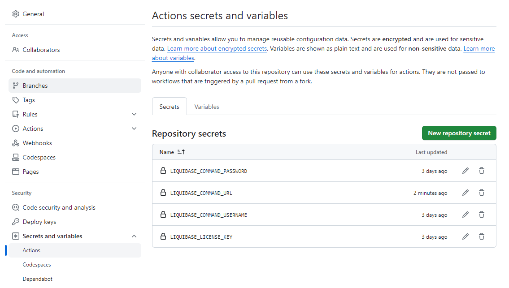
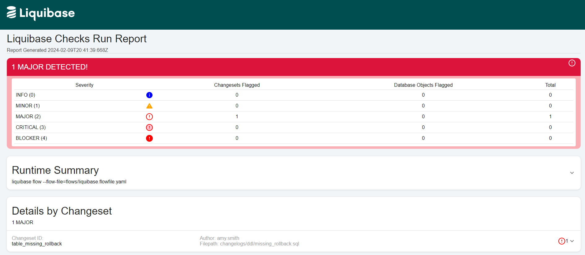
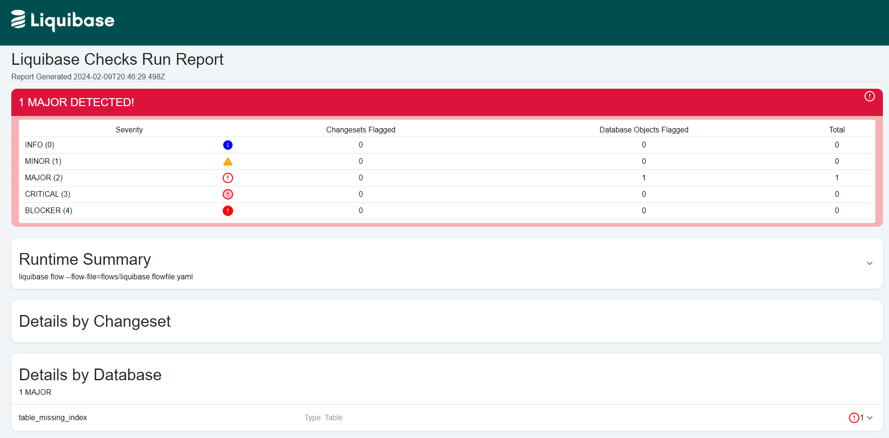

# Policies Exception Handling with Liquibase Pro

This repo contains sample code for handling Liquibase Policy exceptions using Liquibase Pro. 
The functionality allows teams to have temporary exceptions granted for an organization's database policies.

## Liquibase Pro Features

The following Liquibase Pro features are used within this repo:
- [Liquibase Flows](https://docs.liquibase.com/commands/flow/flow.html)
- [Liquibase Quality Checks](https://docs.liquibase.com/commands/quality-checks/home.html)
- [Liquibase Reports](https://docs.liquibase.com/tools-integrations/observability/operation-reports.html)

## Installation Dependencies

The following software is required:
- [Liquibase](https://www.liquibase.com/download) - version 4.26.0 is recommended for Check Report functionality
- [Liquibase Pro license key](https://www.liquibase.com/trial) - non existing customer can request a free trial
- [jq](https://jqlang.github.io/jq/) - JSON command-line parser

## Configuration
- [ ] [Configure Quality Checks](https://docs.liquibase.com/commands/quality-checks/workflows/use-checks-settings-config-file.html) Adjust the Quality Checks housed within the **quality_checks** folder
- [ ] [Configure Quality Checks Overrides](#policy-exception-json-format) in **quality_checks_overrides** folder using the below Policy Exception JSON Format
- [ ] [Setup GitHub Secrets](#required-github-secrets) in your GitHub repo's Settings -> Secrets and variables -> Actions
- [ ] [Modify your changelogs](https://docs.liquibase.com/concepts/changelogs/home.html) in **changelogs** folder
- [ ] Optionally adjust your schema name in **liquibase.properties**
- [ ] Optionally adjust your application name in **.github/liquibase_workflow.yaml**

## Policy Exception JSON Format

```
{
    "qualityChecksOverrides": [
        {
            "app_name": "APP_ABC",
            "policy": "RollbackRequired",
            "time_to_live_days": 60,
            "start_date": "2024-01-01T18:23:33Z"
        },
		...
    ]
}
```

## Required GitHub Secrets

This repo requires setting up the following GitHub secrets:
- LIQUIBASE_COMMAND_URL
- LIQUIBASE_COMMAND_USERNAME
- LIQUIBASE_COMMAND_PASSWORD
- LIQUIBASE_LICENSE_KEY

### GitHub Secrets configuration



## Usage

In this repo the following files should trigger check errors:

1. **changelogs/ddl/missing_rollback.sql** - This file is missing a rollback tag and triggers the **RollbackRequired** changelog check.
2. **changelogs/ddl/missing_index.sql** - This file contains a table without an index and triggers the **CheckTablesForIndex** database check.  

You can add exceptions for these errors in the **quality_checks_overrides/qc_overrides.json** by increasing the value for the **time_to_live** node.

## Liquibase Report Samples

Below are screenshots of Liquibase Checks Report. Reports can be found in the accompanying GitHub artifact that is generated with each build.

### Liquibase Checks Report for Changelog Settings



### Liquibase Checks Report for Database Settings


